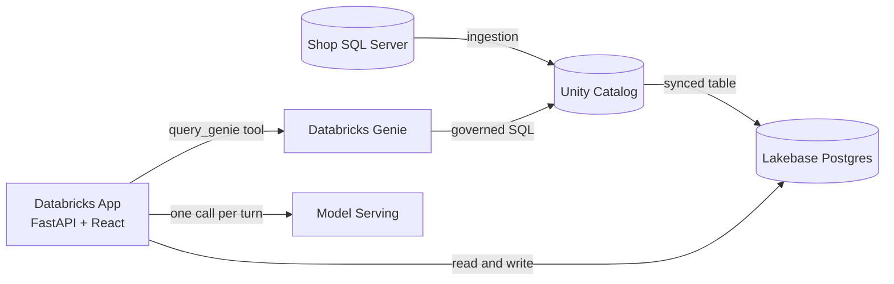

## The problem

A small shop owner carries a few hundred product lines and holds the whole stock position in their head. Milk turns over in two days, atta in five, and a box of chocolate can sit on the shelf for a quarter without anyone noticing. Ordering decisions get made from memory, usually while serving a customer.

Two failures follow, and both cost money quietly.

Stockouts happen when a fast mover runs down inside its supplier lead time. The shelf sits empty, the customer buys elsewhere, and the sale is gone rather than delayed.

Dead stock happens in the opposite direction. Capital sits on a shelf in the form of goods nobody is buying, and perishables reach their expiry date before they reach a customer.

Neither problem is hard to see once the data is in front of you. The difficulty is that the data lives in a till system nobody opens, in a stock register, and in the owner's memory, and none of those three agree with each other.

## What this application does

Shop Owner Assistant brings the stock position into one screen and puts an assistant next to it that can explain the position in plain language.

The **Dashboard** shows current stock, days of cover against supplier lead time, sales, revenue, and upcoming expiry for every product. Every number is computed in SQL, so the screen and the assistant always quote the same figure.

The **Request Stock** page lets the owner select products, set quantities, and submit a request. Requests are recorded with their origin (`manual` or `ai_suggested`), so a request that began as an assistant suggestion is distinguishable from one the owner raised alone.

The **assistant** (a chat widget available on every page) answers questions such as what needs ordering today, what has stopped selling, and what expires this week. It reads the same computed stock position the dashboard reads, and it proposes actions rather than taking them.

## Design principles

These constraints shape every decision in the codebase.

### Numbers come from SQL, words come from the model

Days of cover, suggested order quantity, and slow-mover thresholds are computed by the `retail.v_stock_position` database view. The language model reads those values (via the Genie tool) and explains them. It never calculates. This keeps every figure reproducible and auditable, and it removes the risk of a model quoting arithmetic it invented.

### The model proposes, a human decides

The assistant can recommend an order. It cannot write one. The owner approves through a button, and the application writes the row via `POST /api/stock-requests`. The worst outcome of a bad suggestion is a suggestion the owner declines.

### One writer per table

Each table has exactly one system responsible for writing to it. Master product data (`retail.products`, `retail.stock_on_hand`, `retail.sales_daily`) flows in from the shop's existing system through Unity Catalog. Operational state (`app.stock_requests`, `app.request_lines`, agent conversations) belongs to the application. Shared write access produces silent overwrites that surface weeks later as unexplained numbers.

### One definition of every metric

The `retail.v_stock_position` view wraps the metric logic, and both the dashboard API and the assistant's Genie tool read from it. A screen that disagrees with the assistant destroys trust faster than a missing feature, and there is no way for the owner to tell which one is right.

### The dashboard never depends on the model

Stock, sales, and expiry render without calling model serving. If the assistant is unavailable, the owner still has their numbers. The optional feature never takes the core feature down with it.

## Architecture



Unity Catalog holds the governed history and is where ingestion lands. Lakebase holds the operational data the application reads and writes on every request. Splitting them follows the shape of the work: analytical scans over months of sales suit a column store, while single-row reads and writes suit a row store.

The application's REST API queries Lakebase directly. The assistant reasons with a Model Serving LLM and calls Databricks Genie as a tool whenever it needs a governed answer over Unity Catalog data. Nothing in the request path waits for a warehouse to start.

### Application shape

One deployment serves both halves. FastAPI exposes the JSON API under `/api` and serves the compiled React bundle from every other path, which keeps the browser on a single origin and removes cross-origin configuration entirely.

| Layer | Responsibility |
|-------|----------------|
| React (`frontend/`) | Renders the dashboard, the request form, and the assistant panel |
| FastAPI (`server/`, `main.py`) | Serves the frontend, exposes the API, and enforces the response contract |
| Lakebase (Postgres) | Stores stock, sales, requests, and agent conversation checkpoints |
| Unity Catalog | Governs master data and retains history |
| Databricks Genie | Turns natural-language questions into governed SQL over Unity Catalog |
| Model Serving | Reasons over the conversation and decides when to call Genie |

### Backend components

| File | Responsibility |
|------|----------------|
| [main.py](/c:/Users/AkshatAgrawalMAQSoft/Downloads/finalShopOwnerAssistant/AgentState/main.py) | FastAPI app entrypoint; mounts the API routers and the static React bundle |
| [server/database.py](/c:/Users/AkshatAgrawalMAQSoft/Downloads/finalShopOwnerAssistant/AgentState/server/database.py) | Builds the SQLModel/SQLAlchemy engine; mints and caches Lakebase OAuth tokens |
| [server/model.py](/c:/Users/AkshatAgrawalMAQSoft/Downloads/finalShopOwnerAssistant/AgentState/server/model.py) | SQLModel table definitions and the read-only `StockPosition` view projection |
| [server/schemas.py](/c:/Users/AkshatAgrawalMAQSoft/Downloads/finalShopOwnerAssistant/AgentState/server/schemas.py) | Pydantic request/response contracts for the API |
| [server/agent.py](/c:/Users/AkshatAgrawalMAQSoft/Downloads/finalShopOwnerAssistant/AgentState/server/agent.py) | LangGraph analytics agent: binds an LLM to the Genie tool and runs one turn per chat message |
| [server/genie.py](/c:/Users/AkshatAgrawalMAQSoft/Downloads/finalShopOwnerAssistant/AgentState/server/genie.py) | `query_genie` tool: relays questions to a Databricks Genie space and renders the result |
| [server/checkpointer.py](/c:/Users/AkshatAgrawalMAQSoft/Downloads/finalShopOwnerAssistant/AgentState/server/checkpointer.py) | Lakebase-backed LangGraph `PostgresSaver`, so each conversation thread resumes where it left off |
| [server/routers/dashboard.py](/c:/Users/AkshatAgrawalMAQSoft/Downloads/finalShopOwnerAssistant/AgentState/server/routers/dashboard.py) | `GET /api/dashboard` |
| [server/routers/request.py](/c:/Users/AkshatAgrawalMAQSoft/Downloads/finalShopOwnerAssistant/AgentState/server/routers/request.py) | `POST /api/stock-requests` |
| [server/routers/chat.py](/c:/Users/AkshatAgrawalMAQSoft/Downloads/finalShopOwnerAssistant/AgentState/server/routers/chat.py) | `POST /api/chat` |

### Frontend components

| File | Responsibility |
|------|----------------|
| [frontend/src/App.tsx](/c:/Users/AkshatAgrawalMAQSoft/Downloads/finalShopOwnerAssistant/AgentState/frontend/src/App.tsx) | Top-level layout, header, and tab navigation (Dashboard / Request Stock) |
| [frontend/src/DashboardPage.tsx](/c:/Users/AkshatAgrawalMAQSoft/Downloads/finalShopOwnerAssistant/AgentState/frontend/src/DashboardPage.tsx) | Fetches and renders the stock position table and totals |
| [frontend/src/RequestStockPage.tsx](/c:/Users/AkshatAgrawalMAQSoft/Downloads/finalShopOwnerAssistant/AgentState/frontend/src/RequestStockPage.tsx) | Product picker and quantity form that submits a stock request |
| [frontend/src/ChatWidget.tsx](/c:/Users/AkshatAgrawalMAQSoft/Downloads/finalShopOwnerAssistant/AgentState/frontend/src/ChatWidget.tsx) | Floating assistant panel used on every page |
| [frontend/src/api.ts](/c:/Users/AkshatAgrawalMAQSoft/Downloads/finalShopOwnerAssistant/AgentState/frontend/src/api.ts) | Fetch wrappers for `/api/dashboard`, `/api/stock-requests`, and `/api/chat`, with mock-data fallbacks for offline UI work |
| [frontend/src/types.ts](/c:/Users/AkshatAgrawalMAQSoft/Downloads/finalShopOwnerAssistant/AgentState/frontend/src/types.ts) | TypeScript types mirroring the FastAPI Pydantic schemas |

## Data model

Shop data covers products, stock on hand, and daily sales. Application state covers stock requests, request lines, and the assistant's conversation checkpoints (persisted by LangGraph's `PostgresSaver`).

| Table | Schema | Written by | Purpose |
|-------|--------|-----------|---------|
| `products` | `retail` | Shop's source system (via Unity Catalog ingestion) | Catalog: name, category, price, cost, min order qty, lead time, shelf life |
| `stock_on_hand` | `retail` | Shop's source system | Current quantity and expiry date per product |
| `sales_daily` | `retail` | Shop's source system | Daily units sold and revenue per product |
| `v_stock_position` | `retail` | Database view (read-only) | Computed days of cover, suggested order quantity, and status per product; the single source of truth read by both the dashboard and the assistant |
| `stock_requests` | `app` | FastAPI (`POST /api/stock-requests`) | One row per submitted request, with `source` (`manual`/`ai_suggested`) and `status` (`submitted`/`received`/`cancelled`) |
| `request_lines` | `app` | FastAPI | Product and quantity lines belonging to a `stock_requests` row |
| LangGraph checkpoint tables | `public` | `server/checkpointer.py` (`PostgresSaver.setup()`) | Per-conversation agent state, so a chat thread resumes exactly where it left off |

Metric logic lives in `retail.v_stock_position` rather than application code, which is what allows the dashboard and the assistant to agree by construction rather than by discipline. `status` on that view is one of `must_order_today`, `low`, `ok`, `dead`, or `expiring`.

## API reference

All routes are served under the `/api` prefix; every other path serves the compiled React app.

| Method | Path | Description |
|--------|------|-------------|
| `GET` | `/api/health` | Liveness check; returns the running Python version |
| `GET` | `/api/dashboard` | Returns `generated_at`, roll-up `totals`, and the full `products` stock position list |
| `POST` | `/api/stock-requests` | Creates a stock request with one or more `{product_id, qty}` lines; returns the created request summary |
| `POST` | `/api/chat` | Sends a message to the analytics agent for a `conversation_id` (creates one if omitted); returns the assistant's reply |

## Tech stack

* **Backend:** Python 3.12, FastAPI, SQLModel/SQLAlchemy, `psycopg`, LangGraph + `langgraph-checkpoint-postgres`, LangChain (`langchain-openai` client against Databricks Model Serving), Databricks SDK
* **Frontend:** React 19, TypeScript, Vite, oxlint
* **Data platform:** Databricks Unity Catalog (governed Gold-layer tables), Databricks Lakebase (operational Postgres), Databricks Genie (NL-to-SQL), Databricks Model Serving (Foundation Model APIs)
* **Deployment:** Databricks Apps, running `uvicorn main:app` behind the platform's app runtime

## Project structure

```text
AgentState/
├── main.py                  # FastAPI entrypoint: mounts API routers + static frontend
├── app.yaml                 # Databricks Apps deployment command and environment variables
├── pyproject.toml           # Python project metadata and dependencies (uv)
├── requirements.txt         # Pinned dependency list (pip-installable)
├── .env.example              # Local environment variable template
├── server/                  # FastAPI application code
│   ├── database.py           # Lakebase engine + OAuth token caching
│   ├── model.py               # SQLModel table + view definitions
│   ├── schemas.py              # Pydantic request/response contracts
│   ├── agent.py                # LangGraph analytics agent
│   ├── genie.py                # Genie tool used by the agent
│   ├── checkpointer.py          # Lakebase-backed LangGraph checkpointer
│   └── routers/                  # dashboard.py, request.py, chat.py
├── frontend/                # React + TypeScript + Vite app (source of the /static bundle)
│   └── src/                  # App.tsx, DashboardPage.tsx, RequestStockPage.tsx, ChatWidget.tsx, api.ts, types.ts
├── static/                   # Built React bundle FastAPI serves (checked in; do not gitignore)
└── scripts/
    └── list_llm_endpoints.py  # Lists/creates chat-capable Model Serving endpoints
```

## Getting started

### Prerequisites

* Python 3.12 (see [.python-version](/c:/Users/AkshatAgrawalMAQSoft/Downloads/finalShopOwnerAssistant/AgentState/.python-version)) and [uv](https://docs.astral.sh/uv/) (or `pip`)
* Node.js 20+ for the frontend
* A Databricks workspace with:
  * A Lakebase (Postgres) instance for operational data
  * Unity Catalog Gold-layer tables for `retail.products`, `retail.stock_on_hand`, `retail.sales_daily`, and the `retail.v_stock_position` view
  * A Genie space scoped to those tables
  * Access to a chat-capable Model Serving endpoint

### Backend setup

```powershell
# Install dependencies
uv sync
# or: pip install -r requirements.txt

# Configure environment variables
Copy-Item .env.example .env
# then fill in PGHOST, PGUSER, LAKEBASE_ENDPOINT, GENIE_SPACE_ID, etc.

# Run the API (serves /api plus whatever is currently in static/)
uv run uvicorn main:app --reload --port 8000
```

Authenticate to Databricks first (for example `databricks auth login`), since `server/database.py` and `server/genie.py` use the Databricks SDK's default credential chain to mint Lakebase tokens and call Genie/Model Serving.

### Frontend setup

```powershell
cd frontend
npm install

# Dev server with hot reload; proxies /api to http://localhost:8000 (see vite.config.ts)
npm run dev

# Production build; outputs into ../static, which FastAPI serves directly
npm run build

# Lint
npm run lint
```

Run the backend (`uvicorn`) and the frontend dev server (`npm run dev`) side by side for local development: the Vite dev server proxies `/api` calls to `http://localhost:8000` while giving you hot reload for the UI. For a single-process check that mirrors production, run `npm run build` then hit the FastAPI server directly on port 8000.

### Environment variables

See [.env.example](/c:/Users/AkshatAgrawalMAQSoft/Downloads/finalShopOwnerAssistant/AgentState/.env.example) for the full template. Key variables:

| Variable | Purpose |
|----------|---------|
| `PGHOST`, `PGPORT`, `PGDATABASE`, `PGUSER`, `PGSSLMODE` | Lakebase Postgres connection details. The password is never stored; it's a short-lived OAuth token minted at runtime via the Databricks SDK |
| `LAKEBASE_ENDPOINT` | Lakebase Autoscaling endpoint path used to mint that token |
| `GENIE_SPACE_ID` | The Databricks Genie space the analytics agent is allowed to query |
| `DATABRICKS_LLM_ENDPOINT` | Optional: pins the agent's reasoning LLM to a specific Model Serving endpoint. Leave unset to auto-discover one (run `python scripts/list_llm_endpoints.py` to see available options) |
| `DATABASE_URL` | Optional local escape hatch: point `server/database.py` and the LangGraph checkpointer at a plain Postgres or SQLite URL instead of Lakebase |

### Deployment

The app deploys as a single [Databricks App](https://docs.databricks.com/en/dev-tools/databricks-apps/index.html). [app.yaml](/c:/Users/AkshatAgrawalMAQSoft/Downloads/finalShopOwnerAssistant/AgentState/app.yaml) defines the run command (`uvicorn main:app --host 0.0.0.0 --port 8000`) and the environment variables the deployed app needs; `PGUSER` is injected automatically by the attached Lakebase resource's service principal. Build the frontend (`npm run build`) before syncing so `static/` contains the latest bundle — `static/` is intentionally not gitignored because `databricks sync` skips anything Git ignores.

## Future scope

The current build serves one shop. The interesting problems begin when the same data covers many.

### From reordering to replenishment

Suggested order quantity today reflects recent sales and supplier lead time. Adding seasonality, festival demand, and weather sensitivity turns a reactive reorder point into a forecast, letting stock arrive ahead of demand rather than in response to a shortage.

### Stock balancing across outlets

An owner running several shops has dead stock in one and a stockout of the same product in another. Comparing stock positions across outlets identifies transfers that clear slow-moving inventory without a purchase, which is the cheapest possible way to fix a shortage.

### Expiry-driven redistribution

Perishables approaching expiry in a low-footfall outlet can be moved to a high-footfall one while they still have shelf life. The signal already exists in the expiry and velocity data. Acting on it converts predictable write-offs into sales.

### Supplier and purchase order integration

Approved requests currently stop at the application boundary. Sending them directly to suppliers, and receiving confirmations and dispatch updates back, closes the loop between deciding to order and knowing when stock arrives.

### Order consolidation and route planning

Freight economics favour fewer, fuller deliveries. Once several shops share a distributor, their approved requests can be batched into consolidated orders and sequenced into delivery routes. The optimisation problem is genuinely a logistics one: minimise trips and distance while respecting lead times, vehicle capacity, and the cold chain for perishables.

### Supplier reliability scoring

Lead time is treated as a fixed number per product today. Measuring actual delivery performance against promised dates produces a reliability score per supplier, which feeds back into safety stock. An unreliable supplier should require more buffer than a dependable one, and that adjustment can be automatic.

## Status

The data layer is in place and the application is deployed. The dashboard, stock request flow, and the LangGraph-based analytics assistant (backed by Databricks Genie and Model Serving) are implemented end to end; metric views and persistence continue to be refined as more shop data is onboarded.
